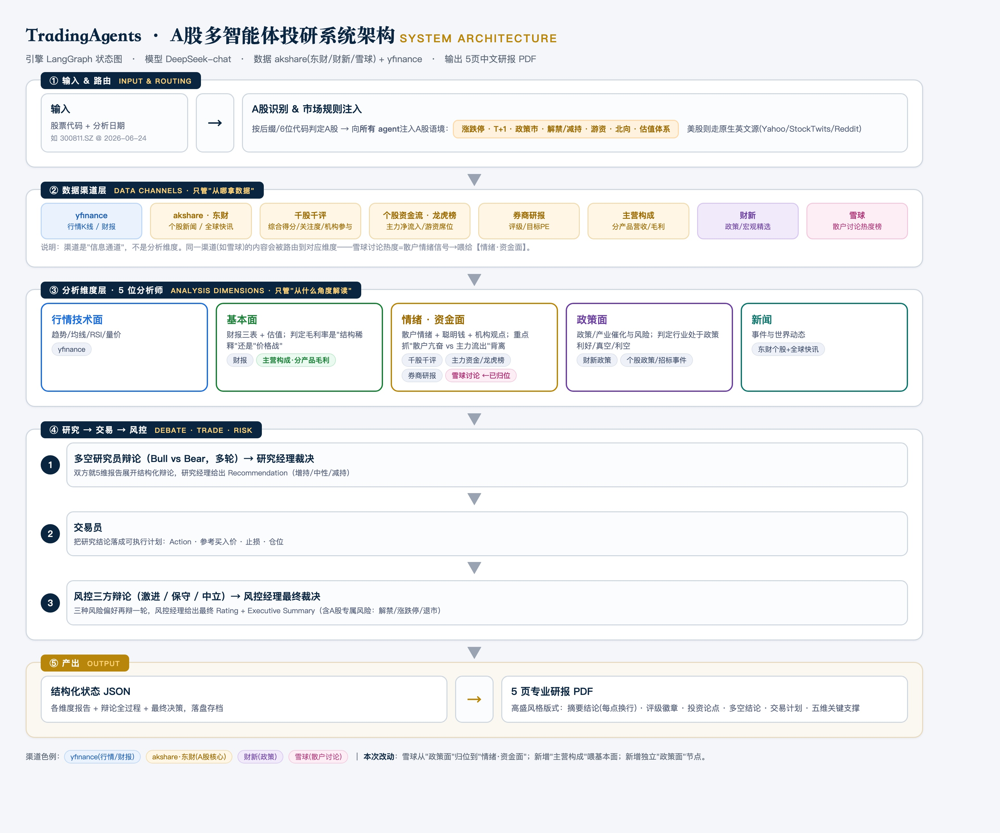

<h1 align="center">Alpha-TradingAgents · A-share Research</h1>

## English overview

An extension of [TradingAgents](https://github.com/TauricResearch/TradingAgents) for A-share research. My additions include akshare data adapters with retry backoff, policy-analysis and report-writer nodes, and PDF rendering from structured report metadata. The analyst/debate framework is inherited from TradingAgents.

- **Explore the implementation:** [data adapters](tradingagents/dataflows/akshare_cn.py), [policy analyst](tradingagents/agents/analysts/policy_analyst.py), [report writer](tradingagents/agents/managers/report_writer.py), and [PDF renderer](make_report_pdf.py).
- **View an output without API keys:** [A-share sample report](samples/铂科新材_300811.SZ_研报样例.pdf) or the [project case study](https://xuxu8421.github.io/alpha.html).
- **Run locally:** the quickstart below covers Python 3.11, dependencies, and an LLM API key. PDF rendering also requires local Chrome; model and data-provider availability may affect live runs.

This is a research and engineering demonstration, not a validated trading strategy. See [upstream documentation](README.upstream.md) and [license](LICENSE) for the original framework.

---


<p align="center">
  <b>面向中国 A 股 + 美股的多智能体（Multi-Agent LLM）投研系统</b><br>
  在 <a href="https://github.com/TauricResearch/TradingAgents">TradingAgents</a> 框架之上，新增 <b>A 股专属信源</b>、<b>政策面分析师</b>、<b>报告整合官</b> 与 <b>结构化 PDF 研报生成</b>。
</p>

<p align="center">
  
</p>

> ⚠️ 本项目仅用于 **AI Agent / 投研方法论的学习与展示**，所有输出均由大模型自动生成，**不构成任何投资建议**。

---

## 这是什么

原版 [TradingAgents](https://github.com/TauricResearch/TradingAgents)（[arXiv:2412.20138](https://arxiv.org/abs/2412.20138)）是一套用 LangGraph 编排的多智能体炒股框架：分析师团队 → 多空研究员辩论 → 交易员 → 风险委员会辩论 → 组合经理，模拟一家投研机构的决策流程。但它**面向美股设计**——情绪/新闻信源是 StockTwits / Reddit / yfinance，对 A 股几乎查无内容，也没有 A 股特有的「政策市」视角。

本项目把它**改造成可用于 A 股的投研系统**，并补齐了机构研报的「最后一公里」（输出一份排版专业的 PDF）。给一个股票代码，它会自动跑完整条流水线，产出一份带评级、目标价、止损位的中文研报。

---

## 我做的增强（What I built on top）

| # | 增强 | 说明 |
|---|---|---|
| 1 | **A 股信源接入层** (`tradingagents/dataflows/akshare_cn.py`) | 基于 `akshare` 接入东方财富 / 财新 / 雪球：个股新闻、全球财经快讯、**千股千评**量化情绪、**主力资金流**、**龙虎榜**、**券商研报评级**、**主营构成**（分产品/分地区营收与毛利）、**雪球散户讨论热度**、**财新政策快讯**。带指数退避重试，抵御接口抖动。 |
| 2 | **政策面分析师**（新增图节点 `analysts/policy_analyst.py`） | A 股是「政策市」——单独引入一个分析师，专盯产业政策 / 监管信号 / 国产替代 / 招标补贴等催化与风险，结论并入多空辩论。 |
| 3 | **报告整合官**（新增图节点 `managers/report_writer.py`） | 在组合经理决策之后，由一个「主编」Agent 把所有分析师产出、辩论、决策**重新组织成一篇连贯研报**：统一标题层级、去除 AI 内部独白、消除前后矛盾、表格适量。并输出一段隐藏 META 作为 PDF 卡片的共享数据源，减少重复维护造成的不一致；生成后仍需核查。 |
| 4 | **A 股市场上下文注入** (`agents/utils/agent_utils.py`) | 把 A 股交易规则（涨跌停 / T+1 / 政策市 / 散户主导 / 限售解禁 / 股权质押 / ST 退市等）注入共享上下文，让**每个** Agent 都按 A 股逻辑推理，而非套用美股假设。 |
| 5 | **信源路由与降级** (`run_demo.py` + `dataflows/interface.py`) | 自动识别 A 股代码（`600519.SS` / `300811.SZ` / 6 位纯数字），优先走 akshare，失败时回落 yfinance；美股则纯走 yfinance。 |
| 6 | **结构化 PDF 研报生成** (`make_report_pdf.py`) | 深蓝与金色版式：抬头 + 评级/操作/买入价/止损/目标价卡片 + 摘要 callout + 正文。按市场自动切换数据来源标注，控制在 4–5 页。 |

> 上游已有的多智能体框架、辩论机制、记忆/反思等能力均保留并复用。完整原始文档见 [README.upstream.md](README.upstream.md)。

---

## 样例产出

`samples/` 目录下放了两份真实跑出来的研报：

- 📄 [铂科新材 (300811.SZ)](samples/铂科新材_300811.SZ_研报样例.pdf) —— A 股，结论「持有」（基本面优质但 PE 92.9x 透支、Q1 毛利率边际恶化）
- 📄 [SpaceX (SPCX)](samples/SpaceX_SPCX_研报样例.pdf) —— 美股，结论「减持」（785x 远期 PE、自由现金流缺口、解禁供给冲击）

---

## 快速开始

```bash
# 1. 安装依赖（建议 Python 3.11 + 虚拟环境）
python3.11 -m venv .venv && source .venv/bin/activate
pip install -e .
pip install akshare markdown python-dotenv

# 2. 配置 Key（默认用 DeepSeek，性价比高、中文好）
cp .env.example .env
#   编辑 .env，填入 DEEPSEEK_API_KEY

# 3. 跑一只股票（A 股 / 美股都行）
python run_demo.py 300811.SZ 2026-06-24    # A 股：铂科新材
python run_demo.py SPCX 2026-06-24         # 美股：SpaceX

# 4. 生成结构化 PDF 研报（输出到桌面）
python make_report_pdf.py 300811.SZ
```

> PDF 转换依赖本机 Chrome（headless `--print-to-pdf`）。macOS 默认路径已内置，其他系统改 `make_report_pdf.py` 顶部的 `CHROME` 变量即可。

---

## 流水线

```
分析师团队（基本面 / 技术面 / 新闻 / 情绪[A股: 千股千评+资金+龙虎榜+研报+雪球]）
        │
   ▼ 政策面分析师（A 股新增）
        │
   多空研究员辩论 ──► 交易员 ──► 风险委员会辩论 ──► 组合经理
        │
   ▼ 报告整合官（新增，产出统一研报 + META）
        │
   make_report_pdf.py ──► 结构化 PDF
```

---

## 致谢与许可

- 本项目基于 **[TradingAgents](https://github.com/TauricResearch/TradingAgents)**（Tauric Research）二次开发，原框架版权与思想归原作者所有，沿用其许可（见 [LICENSE](LICENSE)）。
- A 股数据由开源库 **[akshare](https://github.com/akfamily/akshare)** 提供。
- 上游论文：*TradingAgents: Multi-Agents LLM Financial Trading Framework*, [arXiv:2412.20138](https://arxiv.org/abs/2412.20138)。

```bibtex
@misc{xu2024tradingagents,
      title={TradingAgents: Multi-Agents LLM Financial Trading Framework},
      author={Yijia Xiao and Edward Sun and Di Luo and Wei Wang},
      year={2024},
      eprint={2412.20138},
      archivePrefix={arXiv},
      primaryClass={q-fin.TR}
}
```
