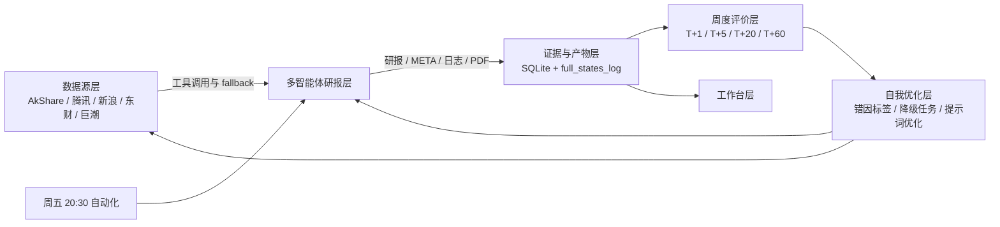

# A股投研 R&D Agent 架构

这份图用于和工作台里的“系统架构图”保持一致。系统图采用 Mermaid，原因是 Mermaid 可以在 GitHub Markdown 中直接维护，改架构时不需要重新画图。

## 分层职责

| 层级 | 职责 | 当前状态 |
| --- | --- | --- |
| 数据源层 | 行情、估值、财报、新闻、资金流、政策、公告 | AkShare / 腾讯 / 新浪已接入，巨潮公告规划中 |
| 多智能体研报层 | 生成市场、新闻、舆情、基本面、风险和最终研报 | 沿用 TradingAgents 图结构 |
| 证据与产物层 | 保存 `full_states_log`、PDF、SQLite run/outcome/score | 已接入工作台 |
| 周度评价层 | 对比研报结论和 T+1/T+5/T+20/T+60 走势 | 已自动化 |
| 自我优化层 | 把降级、错因、缺字段转为优化任务 | 已接入优化队列 |
| 工作台层 | 总览、选股池、研报核验、架构、数据源、任务 | 已改版 |
| 自动化层 | 每周五 20:30 触发复盘并刷新页面 | 已配置 |

## GitHub 调研依据

- Mermaid 官方仓库说明其目标是用文本定义生成可维护图表，并支持 GitHub Markdown 渲染：https://github.com/mermaid-js/mermaid
- `a-stock-data` 的 A 股数据源设计强调腾讯/新浪/通达信优先，东财只用于独有数据且需要限流：https://github.com/simonlin1212/a-stock-data
- 开源投研 dashboard 常见信息架构是 KPI 总览、watchlist、research/backtest drill-down，例如：https://github.com/Tanmai019/ai-stock-dashboard
